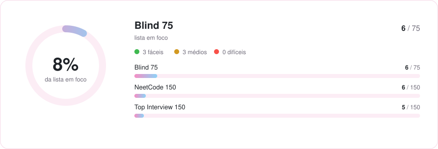
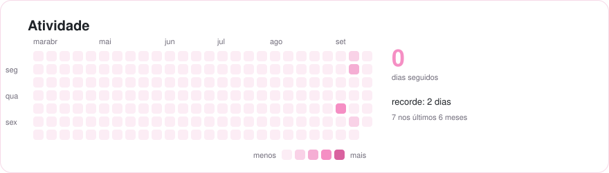

<div align="center">

# 🧩 LeetCode

Repositório dos meus leetcodes resolvidos, seguindo as listas<br>
**[Blind 75](https://neetcode.io/practice?tab=blind75)** → **[NeetCode 150](https://neetcode.io/practice?tab=neetcode150)** → **[Top Interview 150](https://leetcode.com/studyplan/top-interview-150/)**

   

</div>

<br>

## 📊 Estatísticas

<picture>
  <source media="(prefers-color-scheme: dark)" srcset="assets/estatisticas-escuro.svg">
  
</picture>

<picture>
  <source media="(prefers-color-scheme: dark)" srcset="assets/atividade-escuro.svg">
  
</picture>

### Por lista

| Lista | Progresso | Resolvidos | |
| :-- | :-- | :-: | :-- |
| [Blind 75](https://neetcode.io/practice?tab=blind75) | `█░░░░░░░░░░░` | 6 / 75 | 🎯 em foco |
| [NeetCode 150](https://neetcode.io/practice?tab=neetcode150) | `█░░░░░░░░░░░` | 6 / 150 |  |
| [Top Interview 150](https://leetcode.com/studyplan/top-interview-150/) | `█░░░░░░░░░░░` | 5 / 150 |  |

### Por categoria

| Categoria | Progresso | Resolvidos |
| :-- | :-- | :-: |
| Arrays & Hashing | `█░░░░░░░░░░░` | 2 / 23 |
| Two Pointers | `█░░░░░░░░░░░` | 1 / 9 |
| Sliding Window | `█░░░░░░░░░░░` | 1 / 9 |
| Stack | `░░░░░░░░░░░░` | 0 / 9 |
| Binary Search | `░░░░░░░░░░░░` | 0 / 12 |
| Linked List | `░░░░░░░░░░░░` | 0 / 16 |
| Trees | `░░░░░░░░░░░░` | 0 / 28 |
| Tries | `░░░░░░░░░░░░` | 0 / 3 |
| Heap / Priority Queue | `░░░░░░░░░░░░` | 0 / 9 |
| Backtracking | `░░░░░░░░░░░░` | 0 / 11 |
| Graphs | `░░░░░░░░░░░░` | 0 / 16 |
| Advanced Graphs | `░░░░░░░░░░░░` | 0 / 6 |
| 1-D Dynamic Programming | `█░░░░░░░░░░░` | 1 / 13 |
| 2-D Dynamic Programming | `░░░░░░░░░░░░` | 0 / 16 |
| Greedy | `░░░░░░░░░░░░` | 0 / 10 |
| Intervals | `░░░░░░░░░░░░` | 0 / 8 |
| Math & Geometry | `░░░░░░░░░░░░` | 0 / 15 |
| Bit Manipulation | `█░░░░░░░░░░░` | 1 / 10 |

## ✅ Resolvidos

| # | Problema | Dificuldade | Categoria | Listas | Resolvido | Solução |
| --: | :-- | :-- | :-- | :-- | :-- | :-: |
| 268 | [Missing Number](https://leetcode.com/problems/missing-number/) | 🟢 Fácil | Bit Manipulation | B75 · NC150 | 14/09/26 | [🐍](../0268-missing-number/0268-missing-number.py) |
| 125 | [Valid Palindrome](https://leetcode.com/problems/valid-palindrome/) | 🟢 Fácil | Two Pointers | B75 · NC150 · TI150 | 14/09/26 | [🐍](../0125-valid-palindrome/0125-valid-palindrome.py) |
| 5 | [Longest Palindromic Substring](https://leetcode.com/problems/longest-palindromic-substring/) | 🟡 Médio | 1-D Dynamic Programming | B75 · NC150 · TI150 | 13/09/26 | [🐍](../0005-longest-palindromic-substring/0005-longest-palindromic-substring.py) |
| 128 | [Longest Consecutive Sequence](https://leetcode.com/problems/longest-consecutive-sequence/) | 🟡 Médio | Arrays & Hashing | B75 · NC150 · TI150 | 10/09/26 | [🐍](../0128-longest-consecutive-sequence/0128-longest-consecutive-sequence.py) |
| 3 | [Longest Substring Without Repeating Characters](https://leetcode.com/problems/longest-substring-without-repeating-characters/) | 🟡 Médio | Sliding Window | B75 · NC150 · TI150 | 10/09/26 | [🐍](../0003-longest-substring-without-repeating-characters/0003-longest-substring-without-repeating-characters.py) |
| 1 | [Two Sum](https://leetcode.com/problems/two-sum/) | 🟢 Fácil | Arrays & Hashing | B75 · NC150 · TI150 | 10/09/26 | [🐍](../0001-two-sum/0001-two-sum.py) |

## 🗺️ Roadmap · Blind 75

A lista da vez. 🔒 = precisa de LeetCode Premium · 🎥 = vídeo do NeetCode

<details>
<summary><b>Arrays &amp; Hashing</b> · 2/8</summary>

| | # | Problema | Dificuldade | |
| :-: | --: | :-- | :-- | :-: |
| ⬜ | 217 | [Contains Duplicate](https://leetcode.com/problems/contains-duplicate/) | 🟢 Fácil | [🎥](https://youtu.be/3OamzN90kPg) |
| ⬜ | 242 | [Valid Anagram](https://leetcode.com/problems/valid-anagram/) | 🟢 Fácil | [🎥](https://youtu.be/9UtInBqnCgA) |
| [✅](../0001-two-sum/0001-two-sum.py) | 1 | [Two Sum](https://leetcode.com/problems/two-sum/) | 🟢 Fácil | [🎥](https://youtu.be/KLlXCFG5TnA) |
| ⬜ | 49 | [Group Anagrams](https://leetcode.com/problems/group-anagrams/) | 🟡 Médio | [🎥](https://youtu.be/vzdNOK2oB2E) |
| ⬜ | 347 | [Top K Frequent Elements](https://leetcode.com/problems/top-k-frequent-elements/) | 🟡 Médio | [🎥](https://youtu.be/YPTqKIgVk-k) |
| ⬜ | 238 | [Product of Array Except Self](https://leetcode.com/problems/product-of-array-except-self/) | 🟡 Médio | [🎥](https://youtu.be/bNvIQI2wAjk) |
| ⬜ | 271 | [Encode and Decode Strings](https://leetcode.com/problems/encode-and-decode-strings/) 🔒 | 🟡 Médio | [🎥](https://youtu.be/B1k_sxOSgv8) |
| [✅](../0128-longest-consecutive-sequence/0128-longest-consecutive-sequence.py) | 128 | [Longest Consecutive Sequence](https://leetcode.com/problems/longest-consecutive-sequence/) | 🟡 Médio | [🎥](https://youtu.be/P6RZZMu_maU) |

</details>

<details>
<summary><b>Two Pointers</b> · 1/3</summary>

| | # | Problema | Dificuldade | |
| :-: | --: | :-- | :-- | :-: |
| [✅](../0125-valid-palindrome/0125-valid-palindrome.py) | 125 | [Valid Palindrome](https://leetcode.com/problems/valid-palindrome/) | 🟢 Fácil | [🎥](https://youtu.be/jJXJ16kPFWg) |
| ⬜ | 15 | [3Sum](https://leetcode.com/problems/3sum/) | 🟡 Médio | [🎥](https://youtu.be/jzZsG8n2R9A) |
| ⬜ | 11 | [Container With Most Water](https://leetcode.com/problems/container-with-most-water/) | 🟡 Médio | [🎥](https://youtu.be/UuiTKBwPgAo) |

</details>

<details>
<summary><b>Sliding Window</b> · 1/4</summary>

| | # | Problema | Dificuldade | |
| :-: | --: | :-- | :-- | :-: |
| ⬜ | 121 | [Best Time to Buy And Sell Stock](https://leetcode.com/problems/best-time-to-buy-and-sell-stock/) | 🟢 Fácil | [🎥](https://youtu.be/1pkOgXD63yU) |
| [✅](../0003-longest-substring-without-repeating-characters/0003-longest-substring-without-repeating-characters.py) | 3 | [Longest Substring Without Repeating Characters](https://leetcode.com/problems/longest-substring-without-repeating-characters/) | 🟡 Médio | [🎥](https://youtu.be/wiGpQwVHdE0) |
| ⬜ | 424 | [Longest Repeating Character Replacement](https://leetcode.com/problems/longest-repeating-character-replacement/) | 🟡 Médio | [🎥](https://youtu.be/gqXU1UyA8pk) |
| ⬜ | 76 | [Minimum Window Substring](https://leetcode.com/problems/minimum-window-substring/) | 🔴 Difícil | [🎥](https://youtu.be/jSto0O4AJbM) |

</details>

<details>
<summary><b>Stack</b> · 0/1</summary>

| | # | Problema | Dificuldade | |
| :-: | --: | :-- | :-- | :-: |
| ⬜ | 20 | [Valid Parentheses](https://leetcode.com/problems/valid-parentheses/) | 🟢 Fácil | [🎥](https://youtu.be/WTzjTskDFMg) |

</details>

<details>
<summary><b>Binary Search</b> · 0/2</summary>

| | # | Problema | Dificuldade | |
| :-: | --: | :-- | :-- | :-: |
| ⬜ | 153 | [Find Minimum In Rotated Sorted Array](https://leetcode.com/problems/find-minimum-in-rotated-sorted-array/) | 🟡 Médio | [🎥](https://youtu.be/nIVW4P8b1VA) |
| ⬜ | 33 | [Search In Rotated Sorted Array](https://leetcode.com/problems/search-in-rotated-sorted-array/) | 🟡 Médio | [🎥](https://youtu.be/U8XENwh8Oy8) |

</details>

<details>
<summary><b>Linked List</b> · 0/6</summary>

| | # | Problema | Dificuldade | |
| :-: | --: | :-- | :-- | :-: |
| ⬜ | 206 | [Reverse Linked List](https://leetcode.com/problems/reverse-linked-list/) | 🟢 Fácil | [🎥](https://youtu.be/G0_I-ZF0S38) |
| ⬜ | 21 | [Merge Two Sorted Lists](https://leetcode.com/problems/merge-two-sorted-lists/) | 🟢 Fácil | [🎥](https://youtu.be/XIdigk956u0) |
| ⬜ | 143 | [Reorder List](https://leetcode.com/problems/reorder-list/) | 🟡 Médio | [🎥](https://youtu.be/S5bfdUTrKLM) |
| ⬜ | 19 | [Remove Nth Node From End of List](https://leetcode.com/problems/remove-nth-node-from-end-of-list/) | 🟡 Médio | [🎥](https://youtu.be/XVuQxVej6y8) |
| ⬜ | 141 | [Linked List Cycle](https://leetcode.com/problems/linked-list-cycle/) | 🟢 Fácil | [🎥](https://youtu.be/gBTe7lFR3vc) |
| ⬜ | 23 | [Merge K Sorted Lists](https://leetcode.com/problems/merge-k-sorted-lists/) | 🔴 Difícil | [🎥](https://youtu.be/q5a5OiGbT6Q) |

</details>

<details>
<summary><b>Trees</b> · 0/11</summary>

| | # | Problema | Dificuldade | |
| :-: | --: | :-- | :-- | :-: |
| ⬜ | 226 | [Invert Binary Tree](https://leetcode.com/problems/invert-binary-tree/) | 🟢 Fácil | [🎥](https://youtu.be/OnSn2XEQ4MY) |
| ⬜ | 104 | [Maximum Depth of Binary Tree](https://leetcode.com/problems/maximum-depth-of-binary-tree/) | 🟢 Fácil | [🎥](https://youtu.be/hTM3phVI6YQ) |
| ⬜ | 100 | [Same Tree](https://leetcode.com/problems/same-tree/) | 🟢 Fácil | [🎥](https://youtu.be/vRbbcKXCxOw) |
| ⬜ | 572 | [Subtree of Another Tree](https://leetcode.com/problems/subtree-of-another-tree/) | 🟢 Fácil | [🎥](https://youtu.be/E36O5SWp-LE) |
| ⬜ | 235 | [Lowest Common Ancestor of a Binary Search Tree](https://leetcode.com/problems/lowest-common-ancestor-of-a-binary-search-tree/) | 🟡 Médio | [🎥](https://youtu.be/gs2LMfuOR9k) |
| ⬜ | 102 | [Binary Tree Level Order Traversal](https://leetcode.com/problems/binary-tree-level-order-traversal/) | 🟡 Médio | [🎥](https://youtu.be/6ZnyEApgFYg) |
| ⬜ | 98 | [Validate Binary Search Tree](https://leetcode.com/problems/validate-binary-search-tree/) | 🟡 Médio | [🎥](https://youtu.be/s6ATEkipzow) |
| ⬜ | 230 | [Kth Smallest Element In a Bst](https://leetcode.com/problems/kth-smallest-element-in-a-bst/) | 🟡 Médio | [🎥](https://youtu.be/5LUXSvjmGCw) |
| ⬜ | 105 | [Construct Binary Tree From Preorder And Inorder Traversal](https://leetcode.com/problems/construct-binary-tree-from-preorder-and-inorder-traversal/) | 🟡 Médio | [🎥](https://youtu.be/ihj4IQGZ2zc) |
| ⬜ | 124 | [Binary Tree Maximum Path Sum](https://leetcode.com/problems/binary-tree-maximum-path-sum/) | 🔴 Difícil | [🎥](https://youtu.be/Hr5cWUld4vU) |
| ⬜ | 297 | [Serialize And Deserialize Binary Tree](https://leetcode.com/problems/serialize-and-deserialize-binary-tree/) | 🔴 Difícil | [🎥](https://youtu.be/u4JAi2JJhI8) |

</details>

<details>
<summary><b>Tries</b> · 0/3</summary>

| | # | Problema | Dificuldade | |
| :-: | --: | :-- | :-- | :-: |
| ⬜ | 208 | [Implement Trie Prefix Tree](https://leetcode.com/problems/implement-trie-prefix-tree/) | 🟡 Médio | [🎥](https://youtu.be/oobqoCJlHA0) |
| ⬜ | 211 | [Design Add And Search Words Data Structure](https://leetcode.com/problems/design-add-and-search-words-data-structure/) | 🟡 Médio | [🎥](https://youtu.be/BTf05gs_8iU) |
| ⬜ | 212 | [Word Search II](https://leetcode.com/problems/word-search-ii/) | 🔴 Difícil | [🎥](https://youtu.be/asbcE9mZz_U) |

</details>

<details>
<summary><b>Heap / Priority Queue</b> · 0/1</summary>

| | # | Problema | Dificuldade | |
| :-: | --: | :-- | :-- | :-: |
| ⬜ | 295 | [Find Median From Data Stream](https://leetcode.com/problems/find-median-from-data-stream/) | 🔴 Difícil | [🎥](https://youtu.be/itmhHWaHupI) |

</details>

<details>
<summary><b>Backtracking</b> · 0/2</summary>

| | # | Problema | Dificuldade | |
| :-: | --: | :-- | :-- | :-: |
| ⬜ | 39 | [Combination Sum](https://leetcode.com/problems/combination-sum/) | 🟡 Médio | [🎥](https://youtu.be/GBKI9VSKdGg) |
| ⬜ | 79 | [Word Search](https://leetcode.com/problems/word-search/) | 🟡 Médio | [🎥](https://youtu.be/pfiQ_PS1g8E) |

</details>

<details>
<summary><b>Graphs</b> · 0/6</summary>

| | # | Problema | Dificuldade | |
| :-: | --: | :-- | :-- | :-: |
| ⬜ | 200 | [Number of Islands](https://leetcode.com/problems/number-of-islands/) | 🟡 Médio | [🎥](https://youtu.be/pV2kpPD66nE) |
| ⬜ | 133 | [Clone Graph](https://leetcode.com/problems/clone-graph/) | 🟡 Médio | [🎥](https://youtu.be/mQeF6bN8hMk) |
| ⬜ | 417 | [Pacific Atlantic Water Flow](https://leetcode.com/problems/pacific-atlantic-water-flow/) | 🟡 Médio | [🎥](https://youtu.be/s-VkcjHqkGI) |
| ⬜ | 207 | [Course Schedule](https://leetcode.com/problems/course-schedule/) | 🟡 Médio | [🎥](https://youtu.be/EgI5nU9etnU) |
| ⬜ | 323 | [Number of Connected Components In An Undirected Graph](https://leetcode.com/problems/number-of-connected-components-in-an-undirected-graph/) 🔒 | 🟡 Médio | [🎥](https://youtu.be/8f1XPm4WOUc) |
| ⬜ | 261 | [Graph Valid Tree](https://leetcode.com/problems/graph-valid-tree/) 🔒 | 🟡 Médio | [🎥](https://youtu.be/bXsUuownnoQ) |

</details>

<details>
<summary><b>Advanced Graphs</b> · 0/1</summary>

| | # | Problema | Dificuldade | |
| :-: | --: | :-- | :-- | :-: |
| ⬜ | 269 | [Alien Dictionary](https://leetcode.com/problems/alien-dictionary/) 🔒 | 🔴 Difícil | [🎥](https://youtu.be/6kTZYvNNyps) |

</details>

<details>
<summary><b>1-D Dynamic Programming</b> · 1/10</summary>

| | # | Problema | Dificuldade | |
| :-: | --: | :-- | :-- | :-: |
| ⬜ | 70 | [Climbing Stairs](https://leetcode.com/problems/climbing-stairs/) | 🟢 Fácil | [🎥](https://youtu.be/Y0lT9Fck7qI) |
| ⬜ | 198 | [House Robber](https://leetcode.com/problems/house-robber/) | 🟡 Médio | [🎥](https://youtu.be/73r3KWiEvyk) |
| ⬜ | 213 | [House Robber II](https://leetcode.com/problems/house-robber-ii/) | 🟡 Médio | [🎥](https://youtu.be/rWAJCfYYOvM) |
| [✅](../0005-longest-palindromic-substring/0005-longest-palindromic-substring.py) | 5 | [Longest Palindromic Substring](https://leetcode.com/problems/longest-palindromic-substring/) | 🟡 Médio | [🎥](https://youtu.be/XYQecbcd6_c) |
| ⬜ | 647 | [Palindromic Substrings](https://leetcode.com/problems/palindromic-substrings/) | 🟡 Médio | [🎥](https://youtu.be/4RACzI5-du8) |
| ⬜ | 91 | [Decode Ways](https://leetcode.com/problems/decode-ways/) | 🟡 Médio | [🎥](https://youtu.be/6aEyTjOwlJU) |
| ⬜ | 322 | [Coin Change](https://leetcode.com/problems/coin-change/) | 🟡 Médio | [🎥](https://youtu.be/H9bfqozjoqs) |
| ⬜ | 152 | [Maximum Product Subarray](https://leetcode.com/problems/maximum-product-subarray/) | 🟡 Médio | [🎥](https://youtu.be/lXVy6YWFcRM) |
| ⬜ | 139 | [Word Break](https://leetcode.com/problems/word-break/) | 🟡 Médio | [🎥](https://youtu.be/Sx9NNgInc3A) |
| ⬜ | 300 | [Longest Increasing Subsequence](https://leetcode.com/problems/longest-increasing-subsequence/) | 🟡 Médio | [🎥](https://youtu.be/cjWnW0hdF1Y) |

</details>

<details>
<summary><b>2-D Dynamic Programming</b> · 0/2</summary>

| | # | Problema | Dificuldade | |
| :-: | --: | :-- | :-- | :-: |
| ⬜ | 62 | [Unique Paths](https://leetcode.com/problems/unique-paths/) | 🟡 Médio | [🎥](https://youtu.be/IlEsdxuD4lY) |
| ⬜ | 1143 | [Longest Common Subsequence](https://leetcode.com/problems/longest-common-subsequence/) | 🟡 Médio | [🎥](https://youtu.be/Ua0GhsJSlWM) |

</details>

<details>
<summary><b>Greedy</b> · 0/2</summary>

| | # | Problema | Dificuldade | |
| :-: | --: | :-- | :-- | :-: |
| ⬜ | 53 | [Maximum Subarray](https://leetcode.com/problems/maximum-subarray/) | 🟡 Médio | [🎥](https://youtu.be/5WZl3MMT0Eg) |
| ⬜ | 55 | [Jump Game](https://leetcode.com/problems/jump-game/) | 🟡 Médio | [🎥](https://youtu.be/Yan0cv2cLy8) |

</details>

<details>
<summary><b>Intervals</b> · 0/5</summary>

| | # | Problema | Dificuldade | |
| :-: | --: | :-- | :-- | :-: |
| ⬜ | 57 | [Insert Interval](https://leetcode.com/problems/insert-interval/) | 🟡 Médio | [🎥](https://youtu.be/A8NUOmlwOlM) |
| ⬜ | 56 | [Merge Intervals](https://leetcode.com/problems/merge-intervals/) | 🟡 Médio | [🎥](https://youtu.be/44H3cEC2fFM) |
| ⬜ | 435 | [Non Overlapping Intervals](https://leetcode.com/problems/non-overlapping-intervals/) | 🟡 Médio | [🎥](https://youtu.be/nONCGxWoUfM) |
| ⬜ | 252 | [Meeting Rooms](https://leetcode.com/problems/meeting-rooms/) 🔒 | 🟢 Fácil | [🎥](https://youtu.be/PaJxqZVPhbg) |
| ⬜ | 253 | [Meeting Rooms II](https://leetcode.com/problems/meeting-rooms-ii/) 🔒 | 🟡 Médio | [🎥](https://youtu.be/FdzJmTCVyJU) |

</details>

<details>
<summary><b>Math &amp; Geometry</b> · 0/3</summary>

| | # | Problema | Dificuldade | |
| :-: | --: | :-- | :-- | :-: |
| ⬜ | 48 | [Rotate Image](https://leetcode.com/problems/rotate-image/) | 🟡 Médio | [🎥](https://youtu.be/fMSJSS7eO1w) |
| ⬜ | 54 | [Spiral Matrix](https://leetcode.com/problems/spiral-matrix/) | 🟡 Médio | [🎥](https://youtu.be/BJnMZNwUk1M) |
| ⬜ | 73 | [Set Matrix Zeroes](https://leetcode.com/problems/set-matrix-zeroes/) | 🟡 Médio | [🎥](https://youtu.be/T41rL0L3Pnw) |

</details>

<details>
<summary><b>Bit Manipulation</b> · 1/5</summary>

| | # | Problema | Dificuldade | |
| :-: | --: | :-- | :-- | :-: |
| ⬜ | 191 | [Number of 1 Bits](https://leetcode.com/problems/number-of-1-bits/) | 🟢 Fácil | [🎥](https://youtu.be/5Km3utixwZs) |
| ⬜ | 338 | [Counting Bits](https://leetcode.com/problems/counting-bits/) | 🟢 Fácil | [🎥](https://youtu.be/RyBM56RIWrM) |
| ⬜ | 190 | [Reverse Bits](https://leetcode.com/problems/reverse-bits/) | 🟢 Fácil | [🎥](https://youtu.be/UcoN6UjAI64) |
| [✅](../0268-missing-number/0268-missing-number.py) | 268 | [Missing Number](https://leetcode.com/problems/missing-number/) | 🟢 Fácil | [🎥](https://youtu.be/WnPLSRLSANE) |
| ⬜ | 371 | [Sum of Two Integers](https://leetcode.com/problems/sum-of-two-integers/) | 🟡 Médio | [🎥](https://youtu.be/gVUrDV4tZfY) |

</details>

## 📝 Colinha

Algumas funções e sintaxe que eu vivo esquecendo rs <3 → [`funcoes.py`](../docs/funcoes.py)

## 🔄 Como funciona

Resolvo no [leetcode.com](https://leetcode.com/) e não faço mais nada:

1. a extensão [LeetHub-3.0](https://github.com/raphaelheinz/LeetHub-3.0) commita a solução aqui quando a submissão passa;
2. a [Action](workflows/readme.yml) roda o [gerador](../scripts/atualizar_readme.py) e atualiza este README e os cards;
3. as datas e a sequência de dias saem do próprio histórico do git.

```text
leetcode/
├── 0001-two-sum/           # uma pasta por problema (criada pela extensão)
├── listas/                 # as listas em JSON; lista nova = arquivo novo
├── scripts/                # gerador do README e importador das listas
├── docs/funcoes.py         # a colinha
└── .github/README.md       # este arquivo, gerado
```

Para adicionar uma lista nova (por exemplo o LeetCode 75):

```bash
python3 scripts/importar_listas.py --plano leetcode-75 --ordem 4
```

---

<div align="center">
<sub>última solução em 14/09/2026 · feito com 🩷</sub>
</div>
