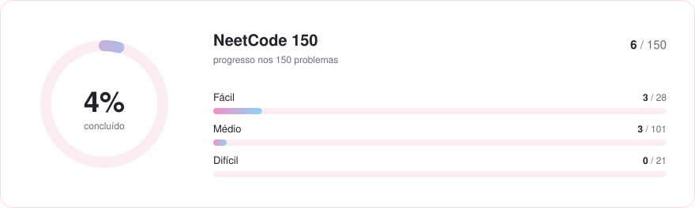

<div align="center">

# 🧩 LeetCode

Repositório para armazenar meus leetcodes resolvidos, primariamente das listas<br>
**[Blind 75](https://neetcode.io/practice?tab=blind75)** e **[NeetCode 150](https://neetcode.io/practice?tab=neetcode150)**

   

</div>

<br>

## 📊 Estatísticas

<picture>
  <source media="(prefers-color-scheme: dark)" srcset="assets/estatisticas-dark.svg">
  
</picture>

> [!NOTE]
> A NeetCode 150 contém a Blind 75 inteira, então todo problema da Blind conta para as duas listas.

### Por categoria

| Categoria | Progresso | NeetCode 150 | Blind 75 |
| :-- | :-- | :-: | :-: |
| Arrays & Hashing | `███░░░░░░░░░` | 2 / 9 | 2 / 8 |
| Two Pointers | `██░░░░░░░░░░` | 1 / 5 | 1 / 3 |
| Sliding Window | `██░░░░░░░░░░` | 1 / 6 | 1 / 4 |
| Stack | `░░░░░░░░░░░░` | 0 / 7 | 0 / 1 |
| Binary Search | `░░░░░░░░░░░░` | 0 / 7 | 0 / 2 |
| Linked List | `░░░░░░░░░░░░` | 0 / 11 | 0 / 6 |
| Trees | `░░░░░░░░░░░░` | 0 / 15 | 0 / 11 |
| Tries | `░░░░░░░░░░░░` | 0 / 3 | 0 / 3 |
| Heap / Priority Queue | `░░░░░░░░░░░░` | 0 / 7 | 0 / 1 |
| Backtracking | `░░░░░░░░░░░░` | 0 / 9 | 0 / 2 |
| Graphs | `░░░░░░░░░░░░` | 0 / 13 | 0 / 6 |
| Advanced Graphs | `░░░░░░░░░░░░` | 0 / 6 | 0 / 1 |
| 1-D Dynamic Programming | `█░░░░░░░░░░░` | 1 / 12 | 1 / 10 |
| 2-D Dynamic Programming | `░░░░░░░░░░░░` | 0 / 11 | 0 / 2 |
| Greedy | `░░░░░░░░░░░░` | 0 / 8 | 0 / 2 |
| Intervals | `░░░░░░░░░░░░` | 0 / 6 | 0 / 5 |
| Math & Geometry | `░░░░░░░░░░░░` | 0 / 8 | 0 / 3 |
| Bit Manipulation | `██░░░░░░░░░░` | 1 / 7 | 1 / 5 |

## ✅ Resolvidos

| # | Problema | Dificuldade | Categoria | Listas | Solução |
| --: | :-- | :-- | :-- | :-- | :-: |
| 1 | [Two Sum](https://leetcode.com/problems/two-sum/) | 🟢 Fácil | Arrays & Hashing | Blind 75 · NeetCode 150 | [🐍](../Blind-75/two-sum.py) |
| 3 | [Longest Substring Without Repeating Characters](https://leetcode.com/problems/longest-substring-without-repeating-characters/) | 🟡 Médio | Sliding Window | Blind 75 · NeetCode 150 | [🐍](../Blind-75/longest-substring-without-repeating-characters.py) |
| 5 | [Longest Palindromic Substring](https://leetcode.com/problems/longest-palindromic-substring/) | 🟡 Médio | 1-D Dynamic Programming | Blind 75 · NeetCode 150 | [🐍](../Blind-75/longest-palindromic-substring.py) |
| 125 | [Valid Palindrome](https://leetcode.com/problems/valid-palindrome/) | 🟢 Fácil | Two Pointers | Blind 75 · NeetCode 150 | [🐍](../Blind-75/valid-palindrome.py) |
| 128 | [Longest Consecutive Sequence](https://leetcode.com/problems/longest-consecutive-sequence/) | 🟡 Médio | Arrays & Hashing | Blind 75 · NeetCode 150 | [🐍](../Blind-75/longest-consecutive-sequence.py) |
| 268 | [Missing Number](https://leetcode.com/problems/missing-number/) | 🟢 Fácil | Bit Manipulation | Blind 75 · NeetCode 150 | [🐍](../Blind-75/missing-number.py) |

## 🗺️ Roadmap

Todos os problemas da NeetCode 150, por categoria. ⭐ = também está na Blind 75.

<details>
<summary><b>Arrays &amp; Hashing</b> · 2/9</summary>

| | # | Problema | Dificuldade | |
| :-: | --: | :-- | :-- | :-: |
| ⬜ | 217 | [Contains Duplicate](https://leetcode.com/problems/contains-duplicate/) | 🟢 Fácil | ⭐ |
| ⬜ | 242 | [Valid Anagram](https://leetcode.com/problems/valid-anagram/) | 🟢 Fácil | ⭐ |
| [✅](../Blind-75/two-sum.py) | 1 | [Two Sum](https://leetcode.com/problems/two-sum/) | 🟢 Fácil | ⭐ |
| ⬜ | 49 | [Group Anagrams](https://leetcode.com/problems/group-anagrams/) | 🟡 Médio | ⭐ |
| ⬜ | 347 | [Top K Frequent Elements](https://leetcode.com/problems/top-k-frequent-elements/) | 🟡 Médio | ⭐ |
| ⬜ | 271 | [Encode and Decode Strings](https://leetcode.com/problems/encode-and-decode-strings/) | 🟡 Médio | ⭐ |
| ⬜ | 238 | [Product of Array Except Self](https://leetcode.com/problems/product-of-array-except-self/) | 🟡 Médio | ⭐ |
| ⬜ | 36 | [Valid Sudoku](https://leetcode.com/problems/valid-sudoku/) | 🟡 Médio |  |
| [✅](../Blind-75/longest-consecutive-sequence.py) | 128 | [Longest Consecutive Sequence](https://leetcode.com/problems/longest-consecutive-sequence/) | 🟡 Médio | ⭐ |

</details>

<details>
<summary><b>Two Pointers</b> · 1/5</summary>

| | # | Problema | Dificuldade | |
| :-: | --: | :-- | :-- | :-: |
| [✅](../Blind-75/valid-palindrome.py) | 125 | [Valid Palindrome](https://leetcode.com/problems/valid-palindrome/) | 🟢 Fácil | ⭐ |
| ⬜ | 167 | [Two Sum II - Input Array Is Sorted](https://leetcode.com/problems/two-sum-ii-input-array-is-sorted/) | 🟡 Médio |  |
| ⬜ | 15 | [3Sum](https://leetcode.com/problems/3sum/) | 🟡 Médio | ⭐ |
| ⬜ | 11 | [Container With Most Water](https://leetcode.com/problems/container-with-most-water/) | 🟡 Médio | ⭐ |
| ⬜ | 42 | [Trapping Rain Water](https://leetcode.com/problems/trapping-rain-water/) | 🔴 Difícil |  |

</details>

<details>
<summary><b>Sliding Window</b> · 1/6</summary>

| | # | Problema | Dificuldade | |
| :-: | --: | :-- | :-- | :-: |
| ⬜ | 121 | [Best Time to Buy and Sell Stock](https://leetcode.com/problems/best-time-to-buy-and-sell-stock/) | 🟢 Fácil | ⭐ |
| [✅](../Blind-75/longest-substring-without-repeating-characters.py) | 3 | [Longest Substring Without Repeating Characters](https://leetcode.com/problems/longest-substring-without-repeating-characters/) | 🟡 Médio | ⭐ |
| ⬜ | 424 | [Longest Repeating Character Replacement](https://leetcode.com/problems/longest-repeating-character-replacement/) | 🟡 Médio | ⭐ |
| ⬜ | 567 | [Permutation in String](https://leetcode.com/problems/permutation-in-string/) | 🟡 Médio |  |
| ⬜ | 76 | [Minimum Window Substring](https://leetcode.com/problems/minimum-window-substring/) | 🔴 Difícil | ⭐ |
| ⬜ | 239 | [Sliding Window Maximum](https://leetcode.com/problems/sliding-window-maximum/) | 🔴 Difícil |  |

</details>

<details>
<summary><b>Stack</b> · 0/7</summary>

| | # | Problema | Dificuldade | |
| :-: | --: | :-- | :-- | :-: |
| ⬜ | 20 | [Valid Parentheses](https://leetcode.com/problems/valid-parentheses/) | 🟢 Fácil | ⭐ |
| ⬜ | 155 | [Min Stack](https://leetcode.com/problems/min-stack/) | 🟡 Médio |  |
| ⬜ | 150 | [Evaluate Reverse Polish Notation](https://leetcode.com/problems/evaluate-reverse-polish-notation/) | 🟡 Médio |  |
| ⬜ | 22 | [Generate Parentheses](https://leetcode.com/problems/generate-parentheses/) | 🟡 Médio |  |
| ⬜ | 739 | [Daily Temperatures](https://leetcode.com/problems/daily-temperatures/) | 🟡 Médio |  |
| ⬜ | 853 | [Car Fleet](https://leetcode.com/problems/car-fleet/) | 🟡 Médio |  |
| ⬜ | 84 | [Largest Rectangle in Histogram](https://leetcode.com/problems/largest-rectangle-in-histogram/) | 🔴 Difícil |  |

</details>

<details>
<summary><b>Binary Search</b> · 0/7</summary>

| | # | Problema | Dificuldade | |
| :-: | --: | :-- | :-- | :-: |
| ⬜ | 704 | [Binary Search](https://leetcode.com/problems/binary-search/) | 🟢 Fácil |  |
| ⬜ | 74 | [Search a 2D Matrix](https://leetcode.com/problems/search-a-2d-matrix/) | 🟡 Médio |  |
| ⬜ | 875 | [Koko Eating Bananas](https://leetcode.com/problems/koko-eating-bananas/) | 🟡 Médio |  |
| ⬜ | 153 | [Find Minimum in Rotated Sorted Array](https://leetcode.com/problems/find-minimum-in-rotated-sorted-array/) | 🟡 Médio | ⭐ |
| ⬜ | 33 | [Search in Rotated Sorted Array](https://leetcode.com/problems/search-in-rotated-sorted-array/) | 🟡 Médio | ⭐ |
| ⬜ | 981 | [Time Based Key-Value Store](https://leetcode.com/problems/time-based-key-value-store/) | 🟡 Médio |  |
| ⬜ | 4 | [Median of Two Sorted Arrays](https://leetcode.com/problems/median-of-two-sorted-arrays/) | 🔴 Difícil |  |

</details>

<details>
<summary><b>Linked List</b> · 0/11</summary>

| | # | Problema | Dificuldade | |
| :-: | --: | :-- | :-- | :-: |
| ⬜ | 206 | [Reverse Linked List](https://leetcode.com/problems/reverse-linked-list/) | 🟢 Fácil | ⭐ |
| ⬜ | 21 | [Merge Two Sorted Lists](https://leetcode.com/problems/merge-two-sorted-lists/) | 🟢 Fácil | ⭐ |
| ⬜ | 141 | [Linked List Cycle](https://leetcode.com/problems/linked-list-cycle/) | 🟢 Fácil | ⭐ |
| ⬜ | 143 | [Reorder List](https://leetcode.com/problems/reorder-list/) | 🟡 Médio | ⭐ |
| ⬜ | 19 | [Remove Nth Node From End of List](https://leetcode.com/problems/remove-nth-node-from-end-of-list/) | 🟡 Médio | ⭐ |
| ⬜ | 138 | [Copy List with Random Pointer](https://leetcode.com/problems/copy-list-with-random-pointer/) | 🟡 Médio |  |
| ⬜ | 2 | [Add Two Numbers](https://leetcode.com/problems/add-two-numbers/) | 🟡 Médio |  |
| ⬜ | 287 | [Find the Duplicate Number](https://leetcode.com/problems/find-the-duplicate-number/) | 🟡 Médio |  |
| ⬜ | 146 | [LRU Cache](https://leetcode.com/problems/lru-cache/) | 🟡 Médio |  |
| ⬜ | 23 | [Merge k Sorted Lists](https://leetcode.com/problems/merge-k-sorted-lists/) | 🔴 Difícil | ⭐ |
| ⬜ | 25 | [Reverse Nodes in k-Group](https://leetcode.com/problems/reverse-nodes-in-k-group/) | 🔴 Difícil |  |

</details>

<details>
<summary><b>Trees</b> · 0/15</summary>

| | # | Problema | Dificuldade | |
| :-: | --: | :-- | :-- | :-: |
| ⬜ | 226 | [Invert Binary Tree](https://leetcode.com/problems/invert-binary-tree/) | 🟢 Fácil | ⭐ |
| ⬜ | 104 | [Maximum Depth of Binary Tree](https://leetcode.com/problems/maximum-depth-of-binary-tree/) | 🟢 Fácil | ⭐ |
| ⬜ | 543 | [Diameter of Binary Tree](https://leetcode.com/problems/diameter-of-binary-tree/) | 🟢 Fácil |  |
| ⬜ | 110 | [Balanced Binary Tree](https://leetcode.com/problems/balanced-binary-tree/) | 🟢 Fácil |  |
| ⬜ | 100 | [Same Tree](https://leetcode.com/problems/same-tree/) | 🟢 Fácil | ⭐ |
| ⬜ | 572 | [Subtree of Another Tree](https://leetcode.com/problems/subtree-of-another-tree/) | 🟢 Fácil | ⭐ |
| ⬜ | 235 | [Lowest Common Ancestor of a Binary Search Tree](https://leetcode.com/problems/lowest-common-ancestor-of-a-binary-search-tree/) | 🟡 Médio | ⭐ |
| ⬜ | 102 | [Binary Tree Level Order Traversal](https://leetcode.com/problems/binary-tree-level-order-traversal/) | 🟡 Médio | ⭐ |
| ⬜ | 199 | [Binary Tree Right Side View](https://leetcode.com/problems/binary-tree-right-side-view/) | 🟡 Médio |  |
| ⬜ | 1448 | [Count Good Nodes in Binary Tree](https://leetcode.com/problems/count-good-nodes-in-binary-tree/) | 🟡 Médio |  |
| ⬜ | 98 | [Validate Binary Search Tree](https://leetcode.com/problems/validate-binary-search-tree/) | 🟡 Médio | ⭐ |
| ⬜ | 230 | [Kth Smallest Element in a BST](https://leetcode.com/problems/kth-smallest-element-in-a-bst/) | 🟡 Médio | ⭐ |
| ⬜ | 105 | [Construct Binary Tree from Preorder and Inorder Traversal](https://leetcode.com/problems/construct-binary-tree-from-preorder-and-inorder-traversal/) | 🟡 Médio | ⭐ |
| ⬜ | 124 | [Binary Tree Maximum Path Sum](https://leetcode.com/problems/binary-tree-maximum-path-sum/) | 🔴 Difícil | ⭐ |
| ⬜ | 297 | [Serialize and Deserialize Binary Tree](https://leetcode.com/problems/serialize-and-deserialize-binary-tree/) | 🔴 Difícil | ⭐ |

</details>

<details>
<summary><b>Tries</b> · 0/3</summary>

| | # | Problema | Dificuldade | |
| :-: | --: | :-- | :-- | :-: |
| ⬜ | 208 | [Implement Trie (Prefix Tree)](https://leetcode.com/problems/implement-trie-prefix-tree/) | 🟡 Médio | ⭐ |
| ⬜ | 211 | [Design Add and Search Words Data Structure](https://leetcode.com/problems/design-add-and-search-words-data-structure/) | 🟡 Médio | ⭐ |
| ⬜ | 212 | [Word Search II](https://leetcode.com/problems/word-search-ii/) | 🔴 Difícil | ⭐ |

</details>

<details>
<summary><b>Heap / Priority Queue</b> · 0/7</summary>

| | # | Problema | Dificuldade | |
| :-: | --: | :-- | :-- | :-: |
| ⬜ | 703 | [Kth Largest Element in a Stream](https://leetcode.com/problems/kth-largest-element-in-a-stream/) | 🟢 Fácil |  |
| ⬜ | 1046 | [Last Stone Weight](https://leetcode.com/problems/last-stone-weight/) | 🟢 Fácil |  |
| ⬜ | 973 | [K Closest Points to Origin](https://leetcode.com/problems/k-closest-points-to-origin/) | 🟡 Médio |  |
| ⬜ | 215 | [Kth Largest Element in an Array](https://leetcode.com/problems/kth-largest-element-in-an-array/) | 🟡 Médio |  |
| ⬜ | 621 | [Task Scheduler](https://leetcode.com/problems/task-scheduler/) | 🟡 Médio |  |
| ⬜ | 355 | [Design Twitter](https://leetcode.com/problems/design-twitter/) | 🟡 Médio |  |
| ⬜ | 295 | [Find Median from Data Stream](https://leetcode.com/problems/find-median-from-data-stream/) | 🔴 Difícil | ⭐ |

</details>

<details>
<summary><b>Backtracking</b> · 0/9</summary>

| | # | Problema | Dificuldade | |
| :-: | --: | :-- | :-- | :-: |
| ⬜ | 78 | [Subsets](https://leetcode.com/problems/subsets/) | 🟡 Médio |  |
| ⬜ | 39 | [Combination Sum](https://leetcode.com/problems/combination-sum/) | 🟡 Médio | ⭐ |
| ⬜ | 46 | [Permutations](https://leetcode.com/problems/permutations/) | 🟡 Médio |  |
| ⬜ | 90 | [Subsets II](https://leetcode.com/problems/subsets-ii/) | 🟡 Médio |  |
| ⬜ | 40 | [Combination Sum II](https://leetcode.com/problems/combination-sum-ii/) | 🟡 Médio |  |
| ⬜ | 79 | [Word Search](https://leetcode.com/problems/word-search/) | 🟡 Médio | ⭐ |
| ⬜ | 131 | [Palindrome Partitioning](https://leetcode.com/problems/palindrome-partitioning/) | 🟡 Médio |  |
| ⬜ | 17 | [Letter Combinations of a Phone Number](https://leetcode.com/problems/letter-combinations-of-a-phone-number/) | 🟡 Médio |  |
| ⬜ | 51 | [N-Queens](https://leetcode.com/problems/n-queens/) | 🔴 Difícil |  |

</details>

<details>
<summary><b>Graphs</b> · 0/13</summary>

| | # | Problema | Dificuldade | |
| :-: | --: | :-- | :-- | :-: |
| ⬜ | 200 | [Number of Islands](https://leetcode.com/problems/number-of-islands/) | 🟡 Médio | ⭐ |
| ⬜ | 695 | [Max Area of Island](https://leetcode.com/problems/max-area-of-island/) | 🟡 Médio |  |
| ⬜ | 133 | [Clone Graph](https://leetcode.com/problems/clone-graph/) | 🟡 Médio | ⭐ |
| ⬜ | 286 | [Walls and Gates](https://leetcode.com/problems/walls-and-gates/) | 🟡 Médio |  |
| ⬜ | 994 | [Rotting Oranges](https://leetcode.com/problems/rotting-oranges/) | 🟡 Médio |  |
| ⬜ | 417 | [Pacific Atlantic Water Flow](https://leetcode.com/problems/pacific-atlantic-water-flow/) | 🟡 Médio | ⭐ |
| ⬜ | 130 | [Surrounded Regions](https://leetcode.com/problems/surrounded-regions/) | 🟡 Médio |  |
| ⬜ | 207 | [Course Schedule](https://leetcode.com/problems/course-schedule/) | 🟡 Médio | ⭐ |
| ⬜ | 210 | [Course Schedule II](https://leetcode.com/problems/course-schedule-ii/) | 🟡 Médio |  |
| ⬜ | 684 | [Redundant Connection](https://leetcode.com/problems/redundant-connection/) | 🟡 Médio |  |
| ⬜ | 323 | [Number of Connected Components in an Undirected Graph](https://leetcode.com/problems/number-of-connected-components-in-an-undirected-graph/) | 🟡 Médio | ⭐ |
| ⬜ | 261 | [Graph Valid Tree](https://leetcode.com/problems/graph-valid-tree/) | 🟡 Médio | ⭐ |
| ⬜ | 127 | [Word Ladder](https://leetcode.com/problems/word-ladder/) | 🔴 Difícil |  |

</details>

<details>
<summary><b>Advanced Graphs</b> · 0/6</summary>

| | # | Problema | Dificuldade | |
| :-: | --: | :-- | :-- | :-: |
| ⬜ | 1584 | [Min Cost to Connect All Points](https://leetcode.com/problems/min-cost-to-connect-all-points/) | 🟡 Médio |  |
| ⬜ | 743 | [Network Delay Time](https://leetcode.com/problems/network-delay-time/) | 🟡 Médio |  |
| ⬜ | 787 | [Cheapest Flights Within K Stops](https://leetcode.com/problems/cheapest-flights-within-k-stops/) | 🟡 Médio |  |
| ⬜ | 332 | [Reconstruct Itinerary](https://leetcode.com/problems/reconstruct-itinerary/) | 🔴 Difícil |  |
| ⬜ | 778 | [Swim in Rising Water](https://leetcode.com/problems/swim-in-rising-water/) | 🔴 Difícil |  |
| ⬜ | 269 | [Alien Dictionary](https://leetcode.com/problems/alien-dictionary/) | 🔴 Difícil | ⭐ |

</details>

<details>
<summary><b>1-D Dynamic Programming</b> · 1/12</summary>

| | # | Problema | Dificuldade | |
| :-: | --: | :-- | :-- | :-: |
| ⬜ | 70 | [Climbing Stairs](https://leetcode.com/problems/climbing-stairs/) | 🟢 Fácil | ⭐ |
| ⬜ | 746 | [Min Cost Climbing Stairs](https://leetcode.com/problems/min-cost-climbing-stairs/) | 🟢 Fácil |  |
| ⬜ | 198 | [House Robber](https://leetcode.com/problems/house-robber/) | 🟡 Médio | ⭐ |
| ⬜ | 213 | [House Robber II](https://leetcode.com/problems/house-robber-ii/) | 🟡 Médio | ⭐ |
| [✅](../Blind-75/longest-palindromic-substring.py) | 5 | [Longest Palindromic Substring](https://leetcode.com/problems/longest-palindromic-substring/) | 🟡 Médio | ⭐ |
| ⬜ | 647 | [Palindromic Substrings](https://leetcode.com/problems/palindromic-substrings/) | 🟡 Médio | ⭐ |
| ⬜ | 91 | [Decode Ways](https://leetcode.com/problems/decode-ways/) | 🟡 Médio | ⭐ |
| ⬜ | 322 | [Coin Change](https://leetcode.com/problems/coin-change/) | 🟡 Médio | ⭐ |
| ⬜ | 152 | [Maximum Product Subarray](https://leetcode.com/problems/maximum-product-subarray/) | 🟡 Médio | ⭐ |
| ⬜ | 139 | [Word Break](https://leetcode.com/problems/word-break/) | 🟡 Médio | ⭐ |
| ⬜ | 300 | [Longest Increasing Subsequence](https://leetcode.com/problems/longest-increasing-subsequence/) | 🟡 Médio | ⭐ |
| ⬜ | 416 | [Partition Equal Subset Sum](https://leetcode.com/problems/partition-equal-subset-sum/) | 🟡 Médio |  |

</details>

<details>
<summary><b>2-D Dynamic Programming</b> · 0/11</summary>

| | # | Problema | Dificuldade | |
| :-: | --: | :-- | :-- | :-: |
| ⬜ | 62 | [Unique Paths](https://leetcode.com/problems/unique-paths/) | 🟡 Médio | ⭐ |
| ⬜ | 1143 | [Longest Common Subsequence](https://leetcode.com/problems/longest-common-subsequence/) | 🟡 Médio | ⭐ |
| ⬜ | 309 | [Best Time to Buy and Sell Stock with Cooldown](https://leetcode.com/problems/best-time-to-buy-and-sell-stock-with-cooldown/) | 🟡 Médio |  |
| ⬜ | 518 | [Coin Change II](https://leetcode.com/problems/coin-change-ii/) | 🟡 Médio |  |
| ⬜ | 494 | [Target Sum](https://leetcode.com/problems/target-sum/) | 🟡 Médio |  |
| ⬜ | 97 | [Interleaving String](https://leetcode.com/problems/interleaving-string/) | 🟡 Médio |  |
| ⬜ | 72 | [Edit Distance](https://leetcode.com/problems/edit-distance/) | 🟡 Médio |  |
| ⬜ | 329 | [Longest Increasing Path in a Matrix](https://leetcode.com/problems/longest-increasing-path-in-a-matrix/) | 🔴 Difícil |  |
| ⬜ | 115 | [Distinct Subsequences](https://leetcode.com/problems/distinct-subsequences/) | 🔴 Difícil |  |
| ⬜ | 312 | [Burst Balloons](https://leetcode.com/problems/burst-balloons/) | 🔴 Difícil |  |
| ⬜ | 10 | [Regular Expression Matching](https://leetcode.com/problems/regular-expression-matching/) | 🔴 Difícil |  |

</details>

<details>
<summary><b>Greedy</b> · 0/8</summary>

| | # | Problema | Dificuldade | |
| :-: | --: | :-- | :-- | :-: |
| ⬜ | 53 | [Maximum Subarray](https://leetcode.com/problems/maximum-subarray/) | 🟡 Médio | ⭐ |
| ⬜ | 55 | [Jump Game](https://leetcode.com/problems/jump-game/) | 🟡 Médio | ⭐ |
| ⬜ | 45 | [Jump Game II](https://leetcode.com/problems/jump-game-ii/) | 🟡 Médio |  |
| ⬜ | 134 | [Gas Station](https://leetcode.com/problems/gas-station/) | 🟡 Médio |  |
| ⬜ | 846 | [Hand of Straights](https://leetcode.com/problems/hand-of-straights/) | 🟡 Médio |  |
| ⬜ | 1899 | [Merge Triplets to Form Target Triplet](https://leetcode.com/problems/merge-triplets-to-form-target-triplet/) | 🟡 Médio |  |
| ⬜ | 763 | [Partition Labels](https://leetcode.com/problems/partition-labels/) | 🟡 Médio |  |
| ⬜ | 678 | [Valid Parenthesis String](https://leetcode.com/problems/valid-parenthesis-string/) | 🟡 Médio |  |

</details>

<details>
<summary><b>Intervals</b> · 0/6</summary>

| | # | Problema | Dificuldade | |
| :-: | --: | :-- | :-- | :-: |
| ⬜ | 252 | [Meeting Rooms](https://leetcode.com/problems/meeting-rooms/) | 🟢 Fácil | ⭐ |
| ⬜ | 57 | [Insert Interval](https://leetcode.com/problems/insert-interval/) | 🟡 Médio | ⭐ |
| ⬜ | 56 | [Merge Intervals](https://leetcode.com/problems/merge-intervals/) | 🟡 Médio | ⭐ |
| ⬜ | 435 | [Non-overlapping Intervals](https://leetcode.com/problems/non-overlapping-intervals/) | 🟡 Médio | ⭐ |
| ⬜ | 253 | [Meeting Rooms II](https://leetcode.com/problems/meeting-rooms-ii/) | 🟡 Médio | ⭐ |
| ⬜ | 1851 | [Minimum Interval to Include Each Query](https://leetcode.com/problems/minimum-interval-to-include-each-query/) | 🔴 Difícil |  |

</details>

<details>
<summary><b>Math &amp; Geometry</b> · 0/8</summary>

| | # | Problema | Dificuldade | |
| :-: | --: | :-- | :-- | :-: |
| ⬜ | 202 | [Happy Number](https://leetcode.com/problems/happy-number/) | 🟢 Fácil |  |
| ⬜ | 66 | [Plus One](https://leetcode.com/problems/plus-one/) | 🟢 Fácil |  |
| ⬜ | 48 | [Rotate Image](https://leetcode.com/problems/rotate-image/) | 🟡 Médio | ⭐ |
| ⬜ | 54 | [Spiral Matrix](https://leetcode.com/problems/spiral-matrix/) | 🟡 Médio | ⭐ |
| ⬜ | 73 | [Set Matrix Zeroes](https://leetcode.com/problems/set-matrix-zeroes/) | 🟡 Médio | ⭐ |
| ⬜ | 50 | [Pow(x, n)](https://leetcode.com/problems/powx-n/) | 🟡 Médio |  |
| ⬜ | 43 | [Multiply Strings](https://leetcode.com/problems/multiply-strings/) | 🟡 Médio |  |
| ⬜ | 2013 | [Detect Squares](https://leetcode.com/problems/detect-squares/) | 🟡 Médio |  |

</details>

<details>
<summary><b>Bit Manipulation</b> · 1/7</summary>

| | # | Problema | Dificuldade | |
| :-: | --: | :-- | :-- | :-: |
| ⬜ | 136 | [Single Number](https://leetcode.com/problems/single-number/) | 🟢 Fácil |  |
| ⬜ | 191 | [Number of 1 Bits](https://leetcode.com/problems/number-of-1-bits/) | 🟢 Fácil | ⭐ |
| ⬜ | 338 | [Counting Bits](https://leetcode.com/problems/counting-bits/) | 🟢 Fácil | ⭐ |
| ⬜ | 190 | [Reverse Bits](https://leetcode.com/problems/reverse-bits/) | 🟢 Fácil | ⭐ |
| [✅](../Blind-75/missing-number.py) | 268 | [Missing Number](https://leetcode.com/problems/missing-number/) | 🟢 Fácil | ⭐ |
| ⬜ | 371 | [Sum of Two Integers](https://leetcode.com/problems/sum-of-two-integers/) | 🟡 Médio | ⭐ |
| ⬜ | 7 | [Reverse Integer](https://leetcode.com/problems/reverse-integer/) | 🟡 Médio |  |

</details>

## 📝 Colinha

Algumas funções e sintaxe que eu vivo esquecendo rs <3 → [`funcoes.py`](funcoes.py)

## 📁 Estrutura

```text
leetcode/
├── Blind-75/               # soluções da Blind 75
├── NeetCode-150/           # soluções da NeetCode 150
└── docs/
    ├── README.md            # gerado automaticamente
    ├── atualizar_readme.py  # gera o README e os cards
    ├── funcoes.py           # colinha de sintaxe
    └── assets/              # cards de estatísticas
```

## 🔄 Atualizando

Toda solução começa com o número e o nome do problema na primeira linha:

```python
# 1. Two Sum
```

Depois de adicionar uma solução, é só rodar na raiz do repositório:

```bash
python3 docs/atualizar_readme.py
```

---

<div align="center">
<sub>atualizado em 14/09/2026 · feito com 💜</sub>
</div>
